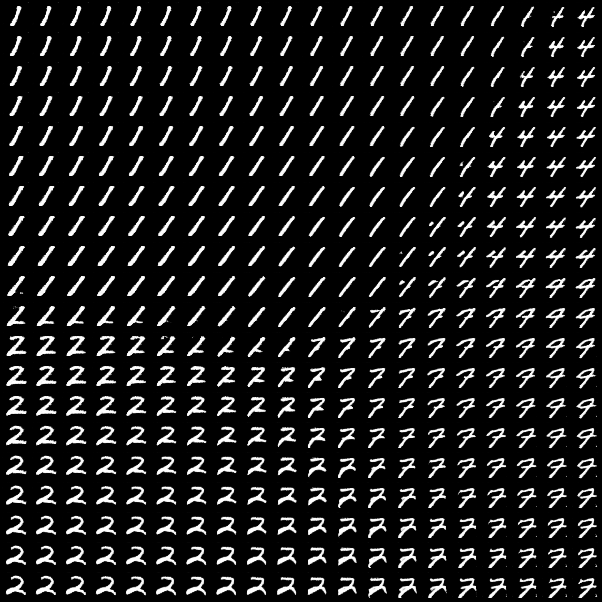

# GAN experiments

Objectives : 

- train a GAN to generate some MNIST digits
- train a GAN to generate larger colored images, why not cute pictures of cats 

## MNIST experiment

### Training the GAN

Below we display a collection of images generated by the generator during 400 epochs. After 50 epochs, you already get
reasonnably good images but I wanted to see what is going on in the long term.

### Interpolation experiment

We take three random vectors. The image of the generator are the fake digits, on the picture below, in the top-left, top-right and bottom-left corners. Then, for every cell, we compute an interpolate random input of which we display the image by the generator.

