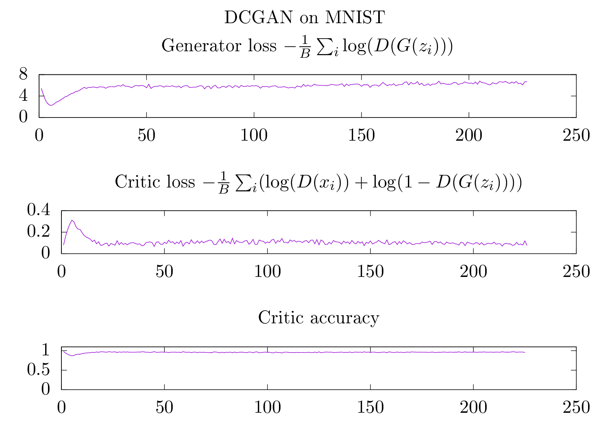
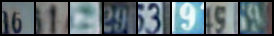
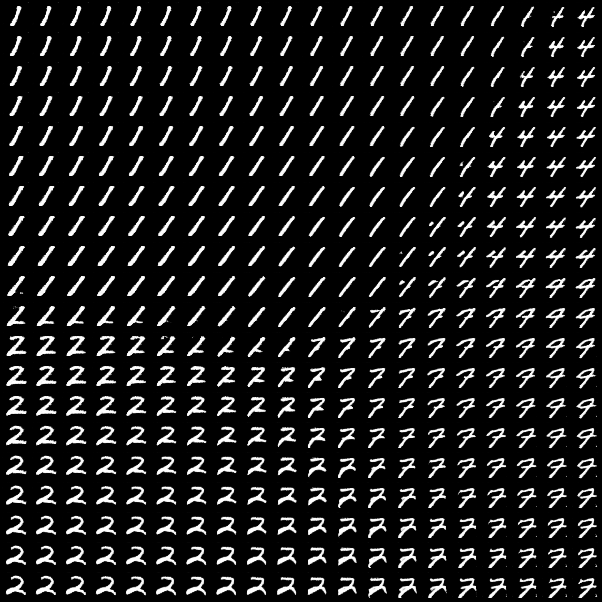
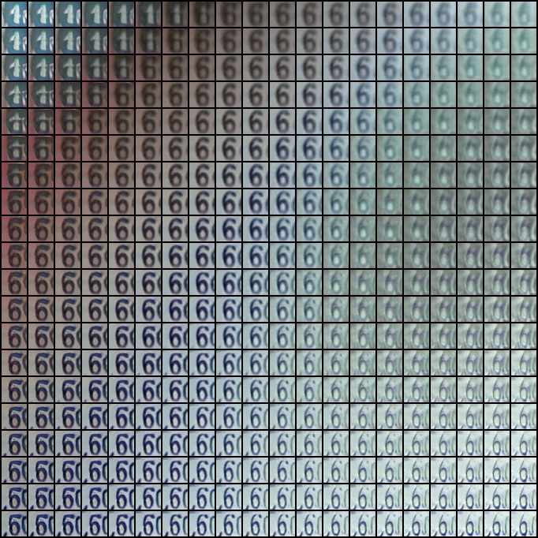

# GAN experiments

Objectives : 

- train a GAN to generate some MNIST digits
- train a GAN to generate larger colored images, why not cute pictures of cats 

## Experiments

### Training the GAN

Below we display a collection of images generated by the generator during 400 epochs. After 50 epochs, you already get
reasonnably good images but I wanted to see what is going on in the long term.

For training, just run 

```
python3 main.py train
```


If you want to test with a different dataset, you can choose between MNIST, FashionMNIST, EMNIST or SVHN. Below is an example of generated images during training on SVHN.


However, I'm really surprised by the losses and accuracies I get : a pretty low discriminator loss, a high discriminator accuracy and a high generator loss. All these metrics seem to indicate the generator is not doing a good job even if the generated digits are indeed, visually, reasonably good. 




### Generating samples

You can generate new samples running : 

```
python3 main.py generate --modelpath generator.pt
```

Here are some examples of fake images using different random inputs.



### Interpolation experiment

We take three random vectors. The image of the generator are the fake digits, on the picture below, in the top-left, top-right and bottom-left corners. Then, for every cell, we compute an interpolate random input of which we display the image by the generator.



Below is an example on SVHN:



